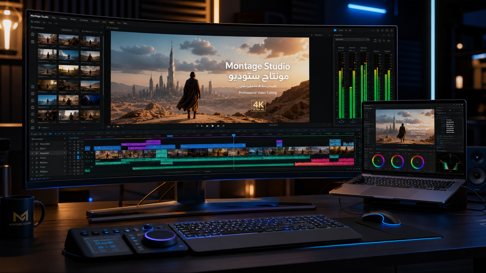
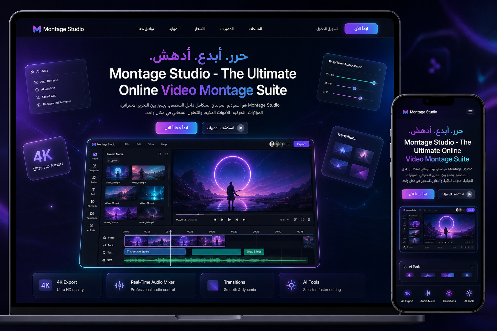

# Montage Studio — ستوديو المونتاج والموشن جرافيك المتكامل

**استوديو مونتاج فيديو وتحريك احترافي متكامل يعمل بالكامل داخل المتصفح**، يجمع بين قوة برامج المونتاج العالمية (Premiere Pro / DaVinci Resolve) وقدرات الموشن جرافيك (After Effects): خط زمني متعدد المسارات، أداة مشرط وقص لحظي (Razor)، انتقالات سينمائية جاهزة، استوديو تسجيل صوتي مباشر (Voiceover)، تسجيل الشاشة والكاميرا، مؤثرات صوتية إجرائية مدمجة، مقياس مستوى صوت حي (Stereo VU Meter)، تلوين سينمائي (Color Grading LUTs)، مقاسات منصات التواصل بضغطة زر، محرر منحنيات، ومعاينة وتصدير فوري بدقة 4K — **بدون أي أدوات بناء أو مكتبات خارجية**.


*معرض استوديو المونتاج — شاشة تحرير سينمائية بدقة 4K ومسارات مونتاج متقدمة*


*معرض الموقع الرسمي وبوابة المونتاج السحابي — تصميم زجاجي متطور مع عرض شامل للمزايا*

---

## التشغيل السريع

```bash
node server.js          # أو: npm start
# ثم افتح http://localhost:5173
```

يُفتح التطبيق مع **مشروع تجريبي جاهز** يعرض: عنوانًا متحركًا، جزيئات، حلقة دوّارة، هالة ضوئية، موجّهًا صوتيًا، تلوينًا سينمائيًا، مقاييس صوت حية، وانتقالات. اضغط **مسافة** للتشغيل الفوري.

```bash
npm test                # تشغيل 100 اختبار وحدة واختبارات التطبيق (jsdom)
```

المتطلب الأساسي: **Node 18+** ومتصفح حديث يدعم Canvas 2D و`MediaRecorder` وWeb Audio API.

---

## المزايا الاحترافية الجديدة

### 1) أداة المشرط والقص اللحظي (Interactive Razor Tool - C)
- أداة المشرط في شريط الأدوات بالزر أو الاختصار `C`، مع العودة لأداة التحديد بـ `V`.
- النقر المباشر بالفأرة على أي مقطع في الخط الزمني يقص المقطع فورياً عند النقطة المحددة بدقة الإطار الواحد.
- مؤشر أحمر إرشادي وتأثير بصري تفاعلي عند تمرير الفأرة فوق المقاطع.
- دعم التقسيم اللحظي عند المؤشر (`Ctrl+Shift+D`) و**الحذف مع الإزاحة (Ripple Delete)** بـ `Shift+Delete`.

### 2) نظام انتقالات الفيديو (Video Transitions Engine)
- تبويب مخصص في اللوحة الجانبية: **الانتقالات** مع بطاقات وأيقونات ومعاينة بالاسم والشرح.
- **12 انتقالاً سينمائياً**:
  1. تلاشٍ متقاطع (Cross Dissolve)
  2. تلاشٍ إلى السواد (Dip to Black)
  3. وميض إلى البياض (Dip to White / Flash)
  4. انزلاق لليسار (Push / Slide Left)
  5. انزلاق لليمين (Push / Slide Right)
  6. انزلاق للأعلى (Slide Up)
  7. تقريب سريع (Zoom In Transition)
  8. تبعيد سينمائي (Zoom Out Transition)
  9. تشويش وانشطار لوني رقمي (Glitch Cut)
  10. مسح عقارب الساعة الدائري (Radial Clock Wipe)
  11. مسح خطي مائل (Linear Soft Wipe)
  12. مسح القزحية الدائري المتسع (Iris Circle)
- تطبيق بنقرة واحدة وضبط للمدة والاتجاه من لوحة الخصائص.

### 3) استوديو التعليق الصوتي المباشر (Voiceover Studio)
- تسجيل صوتي مباشر عبر الميكروفون بضغطة زر 🎙️ في الشريط العلوي وقائمة ملف.
- رسم بياني حي لموجة الصوت أثناء الحديث (Oscilloscope).
- عداد تنازلي (3.. 2.. 1..) ومؤقت زمني دقيق بالثواني والأجزاء.
- إدراج تلقائي للملف المسجل كطبقة صوتية جديدة على الخط الزمني عند موضع المؤشر مباشرة.

### 4) استوديو تسجيل الشاشة والكاميرا (Screen & Webcam Studio)
- تسجيل شاشة الحاسوب كاملة أو نافذة أو تبويب لإنشاء شروحات أو مقاطع ألعاب.
- تسجيل كاميرا الويب المباشرة مع الصوت.
- معاينة مرئية حية للفيديو أثناء التسجيل وإدراج فوري في الخط الزمني عند الإيقاف.

### 5) مكتبة المؤثرات الصوتية الإجرائية (Built-in Procedural SFX)
- مكتبة مؤثرات صوتية مولّدة بالكامل عبر كود Web Audio API وتعمل 100% بدون إنترنت:
  - **Whoosh**: حركة هوائية سريعة للانتقالات وظهور النصوص.
  - **Swoosh**: سحب هوائي ناعم للأيقونات والنوافذ.
  - **Cinematic Boom**: ضربة صب-بيس سينمائية عميقة للمقدمات الدرامية.
  - **Pop Bubble**: فرقعة كرتونية لطيفة للملصقات والعناصر.
  - **Camera Shutter**: نقرة غالق كاميرا واقعية لتجميد اللقطات.
  - **Glitch Zap**: شرارة وتشويش رقمي سايبربانك.
  - **Success Ding**: رنة تأكيد ونجاح بلورية.
  - **Countdown Beep**: صافرة انطلاق دقيقة.
- استماع تجريبي بنقرة زر، وإدراج كطبقة صوتية في الخط الزمني بنقرة واحدة على (+).

### 6) مقياس الصوت الحي في الوقت الحقيقي (Stereo VU Meter)
- مقياس رقمي ستيريو (قناتين L / R) بأعمدة LED تفاعلية (أخضر / أصفر / أحمر) مدمجة في شريط التشغيل.
- قراءة ديسيبل حية (dB) ومؤشر لمستوى الصوت العام، مع مزلاق تحكم بالصوت العام من 0% حتى 150%.

### 7) التلوين السينمائي الاحترافي (Color Grading LUTs)
- **Teal & Orange**: النمط السينمائي الهوليوودي الشهير (ظلال زرقاء وإضاءات برتقالية دافئة).
- **Vintage 35mm**: مظهر الفيلم الكلاسيكي بالألوان الدافئة والأسود المبهوت.
- **Cyberpunk Neon**: ألوان النيون الأرجوانية والزرقاء المشعة.
- **Cinema Noir**: أسود وأبيض عالي التباين بطابع أفلام الغموض والإثارة.

### 8) مقاسات المنصات الاجتماعية بضغطة زر
- قائمة منسدلة سريعة في الشريط العلوي لتغيير أبعاد الفيديو:
  - **16:9** يوتيوب وشاشات عريضة (1920×1080)
  - **4K** سينمائي فائق الدقة (3840×2160)
  - **9:16** تيك توك وإنستغرام ريلز وشورتس (1080×1920)
  - **1:1** مربع إنستغرام (1080×1080)
  - **4:5** منشور طولي إنستغرام (1080×1350)
  - **21:9** شاشات سينمائية عريضة (2560×1080)

### 9) معرض استوديو المونتاج والموقع الرسمي (Showcase & Tour)
- نافذة تفاعلية مدمجة عبر زر **المعرض والموقع** البرّاق في الشريط العلوي.
- استعراض الصور الأصلية فائقة الدقة للتطبيق وللموقع مع إمكانية التحميل والعرض بالحجم الكامل.
- دليل استخدام خطوة بخطوة للبدء في إنتاج الفيديوهات الاحترافية.

---

## المزايا الأساسية

### 1) المشروع والوسائط
- لوحة مشروع بمجلدات، بحث، إعادة تسمية، وحذف، وسحب وإفلات الملفات إلى النافذة.
- استيراد **فيديو / صوت / صور / ملفات مشروع `.mgeproj`**.
- توليد مصغّرات للصور، ورسوم موجات صوتية (Waveform) وبيانات RMS للصوت.
- إضافة أي وسيط كطبقة بنقرة مزدوجة أو بالسحب إلى الخط الزمني.
- مركّبات (Comps) متعددة بتبويبات، ومشروع تجريبي بمفتاح `Ctrl+N`/دبل-كليك على الشعار.

### 2) الخط الزمني
- طبقات بأطوال، سحب وإفلات لإعادة الترتيب والموضع، **قص** من الأطراف، و**تقسيم** عند المؤشر.
- **مفاتيح (Keyframes)**: تشغيل/إيقاف الساعة، إضافة/حذف، تنقّل بين المفاتيح، أنواع سهولة (خطي/ناعم/ثابت/مرن/تسارع…).
- صفوف خصائص داخل الطبقة (التحويل، التأثيرات، الأقنعة) وأعمدة قيم مصغّرة.
- شبكة إطارات، مؤشر متحرك، **منطقة عمل**، **علامات (Markers)**، والتصاق (Snap) مع خط إرشادي.
- **محرر المنحنيات (Graph Editor)**: تحرير سرعة/تأثير المفاتيح، تبديل أنواع السهولة، وتحريك نقاط التحكم بالإصبع/الفأرة.
- أوضاع عرض: كل الخصائص أو **الخصائص المتحركة فقط** (`U`).

### 3) العارض والمعاينة
- تشغيل فوري بمعدل الإطارات الحقيقي مع **تشغيل الصوت المتزامن**، وتحكم بالسرعة (J/K/L).
- تكبير/تصغير وملء، دقة معاينة قابلة للتخفيض، خلفية شطرنجية شفافة.
- **أدوات التحكم (Gizmos)**: إطار الطبقة، مقابض التكبير/الدوران، مركز التحويل، ومستطيل التحديد (Marquee).
- أدلة آمنة (Title/Action Safe)، مسطرة، وشبكة، ولقطة PNG للإطار الحالي.
- أدوات رسم تفاعلية: مستطيل/بيضاوي/نجمة/نص بالسحب، وقلم لرسم الأقنعة.

### 4) الخصائص والتأثيرات
- لوحة خصائص غنية: التحويل، ثلاثي الأبعاد، إعدادات كل نوع طبقة، الصوت، الأقنعة، والتأثيرات.
- حقول قابلة للسحب (Scrub) وبإدخال رقمي، محدّدات ألوان، مربعات اختيار، وقوائم منسدلة.
- **محرر تعبيرات (Expressions)** ببيئة محمية: `value, time, frame, fps, wiggle(), random(), noise(), linear(), ease(), loopOut()…`
- **52 تأثيرًا** في 7 تصنيفات: تمويه/شحذ، ألوان (سطوع، تباين، تشبّع، تدرّج، عوامل الفيلم، تلوين سينمائي)، تشويه (موجة، بكسل، زجاج، انتقال حراري)، انتقالات (تلاشٍ، مسح خطي/شعاعي، انزلاق، آلة كاتبة، قزحية، وميض)، ضوء (توهّج، ظل مسقط، هالة، وميض)، ضوضاء (حبيبات، مسح خطي، ضوضاء كسورية)، وأدوات (جزيئات، موجّه صوتي، خطوط الإطار).
- إضافة التأثير بالنقر من المتصفح أو من قوائم السياق، مع تبديل/ترتيب/حذف/نسخ التأثيرات بين الطبقات.

### 5) الدمج والتركيب
- **13 نوع طبقة**: نص، شكل، صلب، صورة، فيديو، صوت، تركيب مسبق، ضبط (Adjustment)، فارغ، إضاءة، كاميرا، جزيئات، موجّه صوتي.
- **أنماط الدمج** (Normal/Screen/Multiply/Overlay/Add…) و**طبقات Matte** (Alpha/Luma).
- **الأقنعة (Masks)** بأشكال نقطية، مع ملء/تحديد وعكس/ريشة/شفافية.
- تسلسل آباء (Parenting)، تركيب مسبق (Precompose)، Animated/Shy/Locked/Solo، علامات وعناوين.
- محرّك رسم واحد يغذّي المعاينة والتصدير: `drawContent → masks → effects → track matte → blend` مع ذاكرة مؤقتة للإطارات الثابتة.

### 6) القوالب الجاهزة (12 قالبًا)
عنوان حركي، آلة كاتبة، نبض الإيقاع، اهتزاز كاميرا، توهّج سينمائي، فيلم قديم، غليتش، انتقال مسحي، موجّه صوتي، احتفال، Ken Burns، وشريط سفلي (Lower Third) — تُطبَّق بضغطة واحدة على الطبقات المحددة.

### 7) التصدير
| الصيغة | الوصف |
|---|---|
| **WebM (فيديو)** | تسجيل حقيقي للـCanvas عبر `MediaRecorder` مع ضبط الجودة والمعدل |
| **سلسلة PNG** | كل الإطارات داخل ملف **ZIP** واحد (باني ZIP مدمج بدون مكتبات) |
| **APNG** | صورة متحركة مبنية يدويًا (acTL/fcTL/fdAT + CRC32) |
| **WAV** | خلط المسار الصوتي (OfflineAudioContext) وتصديره بموجة PCM |
| **PNG** | الإطار الحالي بدقة مضاعفة |
| **JSON / .mgeproj** | حفظ المشروع كاملًا (طبقات، مفاتيح، تأثيرات، أقنعة، وسائط مرتبطة) |

نافذة التصدير تتيح اختيار النطاق (منطقة العمل / التركيب كامل / نهاية مخصصة)، والمقياس (25%–200%)، والمعدل، وشريط تقدّم مع إمكانية الإلغاء.

### 8) سير العمل والتحكم
- **اختصارات شاملة** مطابقة لبرامج المونتاج: `V/C/H/Z/W/G/Q/E/T` للأدوات، `P/S/R/A/T` للخصائص، `U`، `M`، `[`/`]`، `J/K/L`، `Ctrl+Z/Y/C/X/V/D/A/K/I/E/S/O/N`، `Shift+Del`، ومسافة للتشغيل — اعرضها بـ`F1`.
- **سجل خطوات كامل** (History) قابل للنقر للرجوع لأي حالة، تراجع/إعادة، وحفظ تلقائي في `localStorage`.
- **3 مساحات عمل**: افتراضي، تحريك (خصائص أوسع)، ومعاينة (العارض بأقصى حجم) + وضع مركّز `Ctrl+/`.
- واجهة **عربية RTL** كاملة مع زر تبديل إلى الإنجليزية، وشاشة بداية، وتنبيهات، ونوافذ حوار.

---

## البنية

```
index.html            هيكل الواجهة (أيقونات SVG مدمجة، RTL)
server.js             خادم ثابت بدون حزم — المنفذ 5173
assets/
  montag-studio-showcase.png    صورة استعراض استوديو المونتاج (4K)
  website-showcase.png          صورة استعراض الموقع الرسمي
styles/               app.css · timeline.css · viewer.css
src/
  main.js             نقطة البداية: يربط كل الوحدات (window.MS_APP)
  core/
    util.js           الأدوات والعمليات الحسابية والتحويلات
    transitions.js    محرك وقائمة انتقالات الفيديو المونتاجية
    effects.js        مكتبة التأثيرات والفلاتر والتلوين السينمائي (52 تأثير)
    presets.js        القوالب الجاهزة
    model.js          نموذج البيانات والطبقات والمخططات
    anim.js           التحريك والمفاتيح ومنحنيات بيزيير
    store.js          مخزن الحالة والتراجع والقص والتقسيم
  media/
    soundfx.js        مكتبة وتوليد المؤثرات الصوتية الإجرائية (Web Audio API)
    recorder.js       استوديو تسجيل التعليق الصوتي والشاشة والكاميرا
    audio.js          محرّك الصوت ومقياس VU Meter وتصدير WAV
    media.js          مدير الوسائط والاستيراد
  ui/
    showcase.js       نافذة معرض وموقع الاستوديو
    timeline.js       الخط الزمني وأداة المشرط والمقاطع
    viewer.js         عارض المعاينة وأدوات التحكم
    panels.js         لوحات المشروع والتأثيرات والانتقالات والأصوات
    props.js          لوحة الخصائص الكاملة
    toolbar.js        شريط الأدوات وشريط القوائم
    shortcuts.js      اختصارات لوحة المفاتيح
    dialog.js         نوافذ الحوار

  project/ demo.js (المشروع التجريبي)
tests/  run.js        اختبارات الوحدة + دخان الواجهة (jsdom)
```

**المخزن (Store)** هو المصدر الوحيد للحقيقة: `project`, `selection`, `playhead`, `playing`, `tool`, تاريخ حالات كامل، وأوامر عالية المستوى (طبقات، خصائص، مفاتيح، تأثيرات، أقنعة، وسائط، حافظة). كل الواجهة تشترك فيه وتتفاعل عبر أحداث: `project, change, selection, time, playing, history, timeline, props, assets, render, status, autosave, loaded`.

---

## ملاحظات تقنية
- **بلا مكتبات**: لا React ولا حزم رسوم — Canvas 2D مباشر (يمكن إضاف الويبGL/three لاحقًا للطبقات ثلاثية الأبعاد العميقة).
- **حفظ المشروع**: ملف JSON بامتداد `.mgeproj` + حفظ تلقائي محلي؛ الوسائط تبقى في الذاكرة (تُستورد مجددًا بعد إعادة التحميل، وتُعلَّم بأنها "غير متصلة").
- **الصوت**: يُصدَّر كملف WAV منفصل (تسجيل WebM لا يخلط الصوت في المعاينة الحالية).
- **الخطوط**: يعتمد على خطوط النظام (Cairo/Tajawal إن وُجدت) لضمان العمل دون اتصال.
- اختُبرت الوحدات والواجهة عبر `npm test` (72 حالة: المحرّك، المفاتيح، كل التأثيرات، كل أنواع الطبقات، القوالب، التصدير، الحفظ/الاستعادة).

## رخصة
MIT
